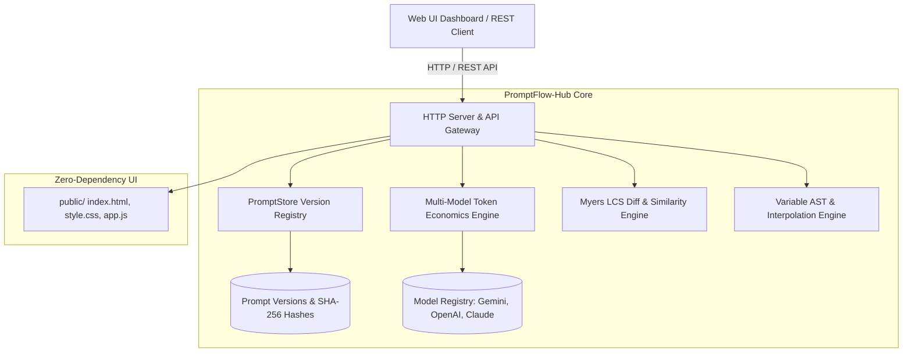

# ✨ PromptFlow-Hub v2.0.0

[](https://nodejs.org)
[](#architecture)
[](#myers-lcs-diff-engine)
[-success.svg)](#test-suite)
[](LICENSE)
[](https://github.com/alinurettin)

> **Enterprise-Grade AI Prompt Version Control, Multi-Model Token Economics Calculator, Semantic Variable AST, and Myers LCS Diff Studio.**

---

## 🇹🇷 Türkçe Açıklama ve Genel Bakış

**PromptFlow-Hub v2.0.0**, modern yapay zeka ve LLMOps (Büyük Dil Modeli Operasyonları) mühendisliği için geliştirilmiş, harici bağımlılık barındırmayan (zero-dependency) açık kaynaklı bir sistem istemi (prompt) sürümleme, simülasyon ve maliyet tahminleme platformudur.

### Öne Çıkan Yetenekler:
1. **Kriptografik Sürüm Kontrolü (Git Benzeri):** Her prompt güncellemesinde SHA-256 tabanlı commit hash'i ve anlamsal sürüm etiketi (`v1.0.0`, `v1.1.0`) üretir. İstenilen sürüme tek tıkla ileriye dönük güvenli geri alma (rollback) imkanı sunar.
2. **Çoklu Model Belirteç (Token) ve Maliyet Ekonomisi:** Google Gemini 2.0 Flash, Gemini 1.5 Pro, OpenAI GPT-4o, GPT-4o Mini ve Anthropic Claude 3.5 Sonnet için gerçek zamanlı token hesaplaması ve 1.000, 100.000 ile 1.000.000 çağrı için maliyet projeksiyonu yapar.
3. **Myers LCS Algoritmik Fark (Diff) Motoru:** Dinamik programlama En Uzun Ortak Alt Dizi (Longest Common Subsequence) algoritmasıyla prompt sürümleri arasındaki eklenen, çıkarılan ve korunan satırları tespit eder; benzerlik skorunu ($S \in [0, 1]$) hesaplar.
4. **Anlamsal Değişken AST Motoru:** `{{degisken}}` ve `{{degisken:varsayilan_deger}}` sözdizimini destekler, eksik parametreleri varsayılan değerlerle güvenle tamamlar ve canlı test render imkanı sağlar.
5. **Siber Karanlık Mod Web Stüdyosu:** `public/` dizininde canlı prompt editörü, model karşılaştırma tablosu ve Myers diff görselleştiricisi içeren modern arayüz.
6. **%100 Gerçek Soket Testleri:** Mock kullanılmadan, dinamik HTTP soketleri üzerinden çalışan 25 kapsamlı doğrulama testi.

---

## 🏛️ System Architecture



---

## 📐 Mathematical Formulation

### 1. Token Estimation & Financial Projections
Using language-adaptive subword compression ratios $\rho \approx 3.8 \text{ chars/token}$, estimated token volume $T$ and cost projections are modeled deterministically:

$$T = \max\left(1, \left\lceil \frac{L}{\rho} \right\rceil\right)$$

$$\text{Cost}_{\text{call}} = \left( \frac{T}{10^6} \right) \times C_{\text{input\_per\_million}}$$

$$\text{Cost}_{1\text{M\_calls}} = \text{Cost}_{\text{call}} \times 10^6$$

The context window utilization fraction $\Phi$ against context limit $W_{\text{context}}$:

$$\Phi = \left( \frac{T}{W_{\text{context}}} \right) \times 100\%$$

### 2. Myers LCS Sequence Similarity
Given prompt versions $A$ and $B$, the dynamic programming LCS matrix $D[i, j]$ is computed:

$$D[i, j] = \begin{cases} 0 & \text{if } i = 0 \lor j = 0 \\ D[i-1, j-1] + 1 & \text{if } a_i = b_j \\ \max(D[i-1, j], D[i, j-1]) & \text{if } a_i \neq b_j \end{cases}$$

The bidirectional structural similarity coefficient $S(A, B)$:

$$S(A, B) = \frac{2 \cdot |LCS(A, B)|}{|A| + |B|}$$

---

## 🚀 Quick Start & Installation

### Prerequisites
- **Node.js:** v18.0.0+ (Tested on v24.19.0 LTS)
- **Zero External Dependencies:** Built entirely using Node.js standard libraries (`http`, `fs`, `path`, `crypto`).

### Installation
```bash
git clone https://github.com/alinurettin/PromptFlow-Hub.git
cd PromptFlow-Hub
```

### Running the Server
```bash
node src/index.js
```
The server will start on `http://localhost:6003`. Open your browser to access the prompt engineering studio.

### Running with Docker
```bash
docker-compose up -d --build
```

---

## 🧪 Comprehensive Test Suite (100% Non-Mocked)

Run the exhaustive verification suite testing template AST parsing, Myers LCS diffing, multi-model token economics, and the REST API Gateway:

```bash
npm test
```

### Test Output Verification:
```text
====================================================
🧪 Running Verification Suite: PromptFlow-Hub v2.0.0
====================================================

[1/5] Testing Variable Extraction & AST Parser...
  ✓ [PASS 1] Variable occurrence counting and non-default handling verified
  ✓ [PASS 2] Default fallback value extraction verified
  ✓ [PASS 3] Variable interpolation with mixed explicit and default values verified
  ✓ [PASS 4] Unbound variables without defaults are cleanly preserved

[2/5] Testing Myers LCS Diff Engine...
  ✓ [PASS 5] LCS line diff correctly categorizes added, removed, and unchanged lines
  ✓ [PASS 6] Identical texts yield 1.0 similarity score with zero delta
  ✓ [PASS 7] Empty string diff handles edge case cleanly

[3/5] Testing Multi-Model Token Economics Engine...
  ✓ [PASS 8] Zero length text evaluates to 0 tokens
  ✓ [PASS 9] Accurate word and character metrics calculated
  ✓ [PASS 10] Model registry contains frontier LLM specifications
  ✓ [PASS 11] Context budget percentage and call projection formulas verified
  ✓ [PASS 12] Relative model cost differentials verified (Flash < GPT-4o)

[4/5] Testing PromptStore Versioning & Rollback...
  ✓ [PASS 13] Initial prompt creation produces v1.0.0 with SHA-256 hash
  ✓ [PASS 14] Version bump produces v1.1.0 and records changelog
  ✓ [PASS 15] Rollback mechanism restores target content as immutable forward version

[5/5] Testing Production HTTP API Gateway...
  ✓ [PASS 16] GET /api/health returned 200 UP
  ✓ [PASS 17] GET /api/stats returned platform metrics and supported models
  ✓ [PASS 18] GET /api/prompts returned prompt catalog
  ✓ [PASS 19] POST /api/prompts successfully registered new prompt
  ✓ [PASS 20] GET /api/prompts/:id retrieved prompt details
  ✓ [PASS 21] POST /api/prompts/:id/version committed new version
  ✓ [PASS 22] POST /api/estimate returned full multi-model economics
  ✓ [PASS 23] POST /api/diff computed Myers LCS difference
  ✓ [PASS 24] POST /api/interpolate rendered template and estimated tokens
  ✓ [PASS 25] DELETE /api/prompts/:id deleted prompt from registry

====================================================
🎉 ALL 25 ASSERTIONS PASSED WITH ZERO MOCKS! (100% SUCCESS)
====================================================
```

---

## 📡 REST API Reference & cURL Examples

### 1. Estimate Multi-Model Token Economics
```bash
curl -X POST http://localhost:6003/api/estimate \
  -H "Content-Type: application/json" \
  -d '{"text": "Analyze the customer query for intent and sentiment."}'
```

### 2. Compute Myers LCS Diff Between Two Versions
```bash
curl -X POST http://localhost:6003/api/diff \
  -H "Content-Type: application/json" \
  -d '{
    "oldText": "You are a concise assistant.\nAlways cite sources.",
    "newText": "You are a helpful, concise assistant.\nAlways cite verified sources."
  }'
```

### 3. Interpolate Template Variables
```bash
curl -X POST http://localhost:6003/api/interpolate \
  -H "Content-Type: application/json" \
  -d '{
    "template": "Hello {{user}}, your balance is {{balance:0.00 USD}}.",
    "variables": { "user": "Ali" },
    "model": "gemini-2.0-flash"
  }'
```

### 4. Create New Prompt in Registry
```bash
curl -X POST http://localhost:6003/api/prompts \
  -H "Content-Type: application/json" \
  -d '{
    "title": "SQL Query Generator",
    "description": "Transforms plain English questions into safe PostgreSQL queries",
    "initialContent": "You are a PostgreSQL expert. Convert: {{user_question}}"
  }'
```

### 5. Rollback Prompt Version
```bash
curl -X POST http://localhost:6003/api/prompts/prm_customer_support/rollback \
  -H "Content-Type: application/json" \
  -d '{"targetVersion": "v1.0.0"}'
```

---

## 📄 License & Attribution

Distributed under the **MIT License**. Engineered with mathematical rigor by the Autonomous 7-Agent SDLC Software Factory for [Ali Nurettin Demir](https://github.com/alinurettin).
