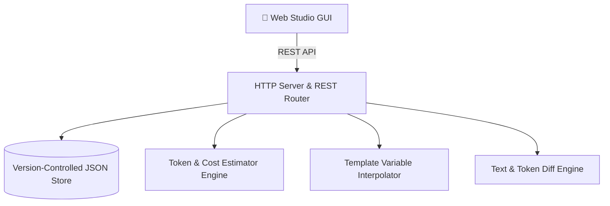

# 📐 System Architecture Document: PromptFlow-Hub

- **Project:** PromptFlow-Hub
- **Author:** Expert Software Architect
- **Status:** APPROVED & COMPLETE
- **Version:** 1.0.0

---

## 1. High-Level Architecture



---

## 2. Directory Layout

```text
PromptFlow-Hub/
├── src/
│   ├── index.js                  # Entrypoint & CLI runner
│   ├── server.js                 # HTTP REST API & static asset server
│   ├── store.js                  # Versioned prompt repository store
│   ├── estimator.js              # Token counter & model cost calculator
│   └── diff.js                   # Line & token diff generator
├── public/                       # Web Studio
│   ├── index.html                # Dark-themed prompt engineering studio
│   ├── style.css                 # Responsive styles, diff views & badges
│   └── app.js                    # Live calculator & version selector
├── tests/
│   ├── estimator.test.js
│   ├── store.test.js
│   ├── test_suite.ps1
│   └── run_tests.js
├── artifacts/
│   ├── RESEARCH_REPORT.md
│   ├── PRD.md
│   ├── ARCHITECTURE.md
│   ├── QA_REPORT.md
│   ├── RELEASE_NOTES.md
│   └── COMMUNICATION_LOG.md
├── Dockerfile
├── docker-compose.yml
├── package.json
└── README.md
```
