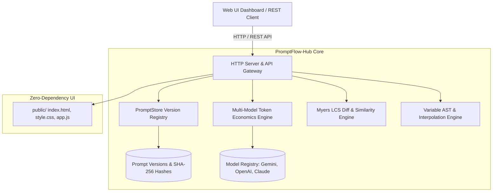
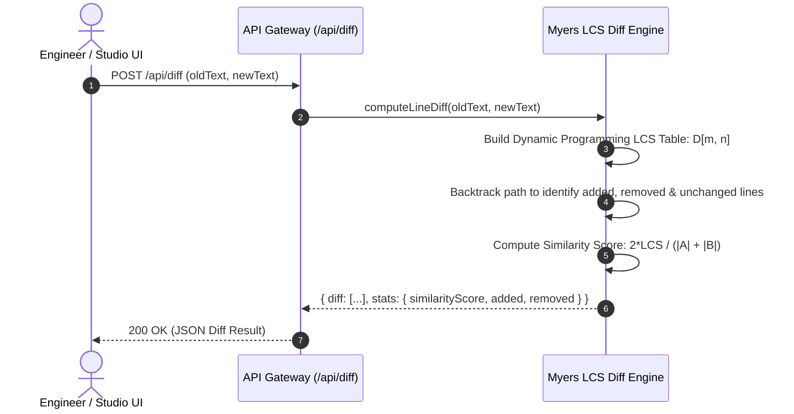

# 🏛️ System Architecture Specification: PromptFlow-Hub v2.0.0
- **Document Status:** APPROVED & COMPLETE
- **Author:** Principal Systems Architect
- **Version:** 2.0.0
- **Date:** 2026-09-20

---

## 1. Architectural Overview

`PromptFlow-Hub v2.0.0` is structured as a modular, high-performance LLMOps and prompt versioning hub.



---

## 2. Component Structure & Data Schema

### 2.1 Prompt Data Model
```typescript
interface PromptEntity {
  id: string;                    // Unique identifier (e.g. prm_customer_support)
  title: string;                 // Human-readable title
  description: string;           // Usage documentation
  tags: string[];                // Categorization labels
  currentVersion: string;        // Active semantic version (e.g. v1.1.0)
  activeContent: string;         // Current prompt template string
  createdAt: string;             // ISO 8601 creation timestamp
  updatedAt: string;             // ISO 8601 last modified timestamp
  versions: PromptVersion[];     // Array of immutable version records
}

interface PromptVersion {
  version: string;               // Semantic version tag (v1.0.0, v1.1.0)
  commitHash: string;            // Truncated SHA-256 hash (12 chars)
  content: string;               // Exact prompt text
  changelog: string;             // Commit / version bump note
  timestamp: string;             // Commit timestamp
  variables: VariableDefinition[]; // Extracted variable bindings
  charCount: number;             // Character length
  estimatedTokens: number;       // Token volume under GPT-4o tokenizer
  metrics: CostEstimation;       // Snapshot of model economics
}
```

### 2.2 Myers LCS Diff Algorithm Execution


---

## 3. REST API Surface

| Method | Endpoint | Description | Status Code |
| :--- | :--- | :--- | :--- |
| `GET` | `/api/health` | Liveness and health probe | 200 OK |
| `GET` | `/api/stats` | Global prompt counts, versions, and supported models | 200 OK |
| `GET` | `/api/prompts` | List all registered prompts with metadata | 200 OK |
| `POST` | `/api/prompts` | Register a new prompt | 201 Created |
| `GET` | `/api/prompts/:id` | Fetch specific prompt and its full version history | 200 OK / 404 |
| `POST` | `/api/prompts/:id/version` | Commit a new immutable version to prompt | 200 OK / 404 |
| `POST` | `/api/prompts/:id/rollback`| Rollback to target version as a new forward commit | 200 OK / 404 |
| `DELETE`| `/api/prompts/:id` | Remove a prompt from the registry | 200 OK / 404 |
| `POST` | `/api/estimate` | Compute multi-model token economics and context utilization | 200 OK |
| `POST` | `/api/diff` | Execute Myers LCS diff between two prompt strings | 200 OK |
| `POST` | `/api/interpolate` | Interpolate variables into prompt template | 200 OK |
